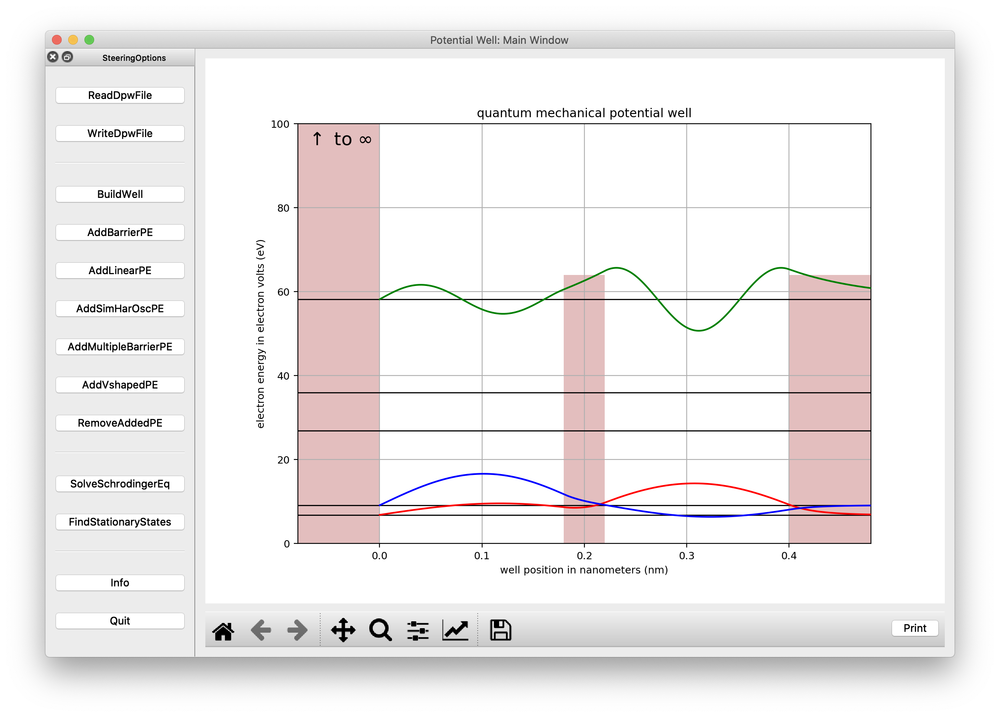
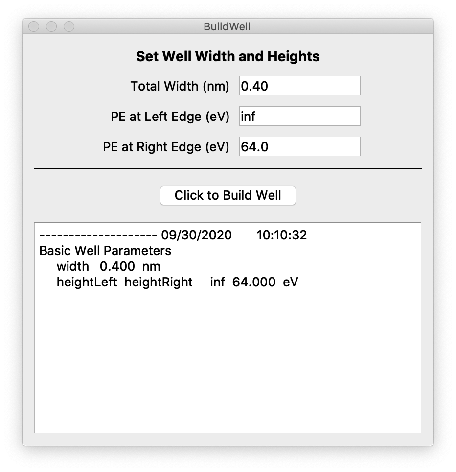
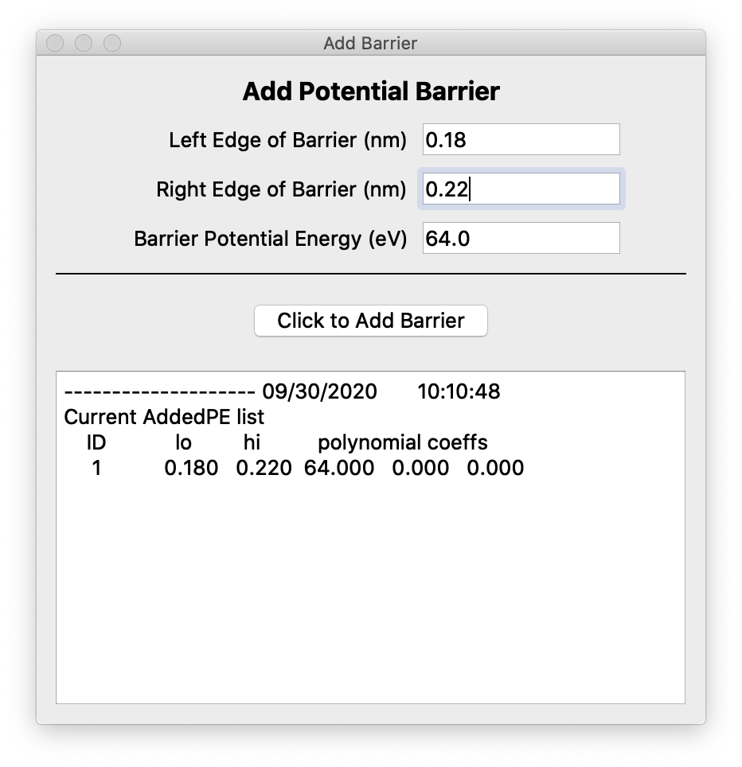
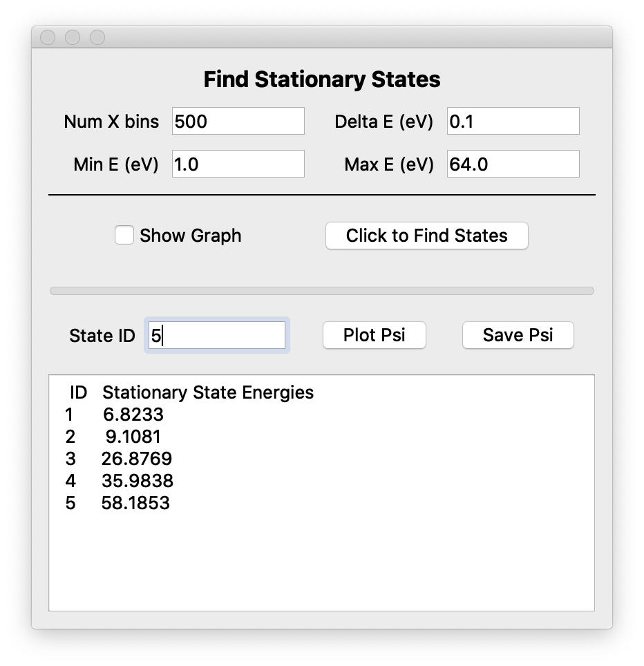

# QuantumWell

Python-based time-independent Schrodinger equation solver using PyQt5 to specify and view a variety of quantum wells, including wells with multiple barriers. The user specifies well parameters or accepts default values. No knowledge of python is necessary. Grinnell College students have used this project since 2016 in their modern physics courses. It was last tested with anaconda python 3.6/7/8, October 2020, for Windows 7 and 10, macOS Catalina, and Linux.

## Getting Started
This package uses python3 and a variety of python modules. If you are new to python, it's easiest to install a python platform such as the widely used [anaconda individual edition](https://www.anaconda.com/products/individual).  We are currently using anaconda with python 3.8 installed with the anaconda  graphical installer using these [installation instructions](https://docs.anaconda.com/anaconda/install/).

### Prerequisites
* macOS, Windows 7/10, or Linux operating system
* python > 3.5, DO NOT USE PYTHON 2.x
* python modules numpy, scipy, pyqt (version 5), matplotlib, and their prerequisites; all are included in the anaconda platform.

Unless you use additional python platforms, I recommend that users new to python take the anaconda install defaults while paying particular attention to these two options:

1. Select *Install for me only* rather than selecting *Install for all users* to avoid needing admin privileges.
2. For installs on Windows, select *Add Anaconda3 to my path environmental variable* even though the installer recommends not using this option. Otherwise, you will have path issues when using the QuantumWell startup scripts.

### Installing and Opening the main GUI

* Download the compressed file from Github.
* Move the Github file to any directory; I recommend your Desktop. If necessary, decompress and extract the contents (double-clicking usually works). You should see the QuantumWell root directory.  Open a file browser in this directory. Execute the config script by double-clicking on:
* `config.bat` for Windows
* `config.command` for macOS
* `config.sh` for Linux os.
* or from a terminal window in the QuantumWell directory, execute `python config.py`

Depending on your operating system, the `config.py` script produces one of the following startup scripts both in your QuantumWell directory and on your Desktop:
* `startQWell.bat` script for Windows machines
* `startQWell.command` for macOS machines
* `startQWell.sh` script for Linux systems

You can copy the appropriate 'startQWell.xx' to any directory you wish.

The `config.py` python script also creates a `qwconfig` directory off of your home directory. The `config` file in the `qwconfig` directory contains the path to your QuantumWell directory and can be used to set the path for importing modules from the `src` directory into e.g. jupyter notebooks. There are more details in the [Documentation/UsersGuide](Documentation/Users_Guide.pdf). If you are only using the GUIs, you can ignore this paragraph.

Open the QuantumWell GUI by
* Double-clicking the `startQWell` script from a file browser (set on any directory containing the script)
* or from a cmd Windows terminal typing,
`python <path to QuantumWell directory>\quantumWell.py`.
* or from a macOS or Linux terminal typing,
`python <path to QuantumWell directory>/quantumWell.py`
* or open a terminal and `cd` to the location of your `startQWell` script and execute the script from the terminal prompt.

## Usage

The QuantumWell GUIs are largely selfexplanatory. Each button on the main GUI opens a side window to set and record well parameters. The *SolveSchrodingerEq* window shows the wavefunction for a given energy (and will diverge if the energy is not a stationary state energy). The *FindStationaryStates* window permits determination of the stationary-state energies and plotting selected state wavefunctions on the main window. The always present *Message* window shows the history of your session; sending the history to a file and/or to a printer are *Message* window options.

You can find more details in the [Documentation/UsersGuide](Documentation/Users_Guide.pdf)

Here is an image of the main window after using default parameters from the *BuildWell*, *AddBarrierPE*, and *FindStationaryStates* windows. Images of these windows follow the main window.

 

## Tutorials
The `Tutorials` directory contains jupitor notebook tutorials to provide guides for using the QuantumWell modules in the src directory.  There is more information about these modules in the
[Documentation/UsersGuide](Documentation/Users_Guide.pdf)
## Author

Charlie Duke
Professor Emeritus of Physics
Physics Department
Grinnell College
Grinnell, Iowa 50112

## License

This program is free software; you can redistribute it and/or modify it under the terms of the GNU General Public License as published by the Free Software Foundation, either version 3 (GNU_GPL_v3) or any later version.

This program is distributed in the hope that it will be useful, but WITHOUT ANY WARRANTY; without even an implied warranty of or FITNESS FOR A PARTICULAR PURPOSE. See the GNU General Public License for more details in the LICENSE file,  in the main directory of this package.

## Acknowledgments

The Grinnell College physics faculty andr second-year modern-physics students have provided many important suggestions leading to a useful and robust code for an introduction to quantum-mechanical potential wells.
